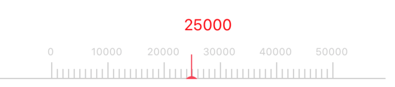
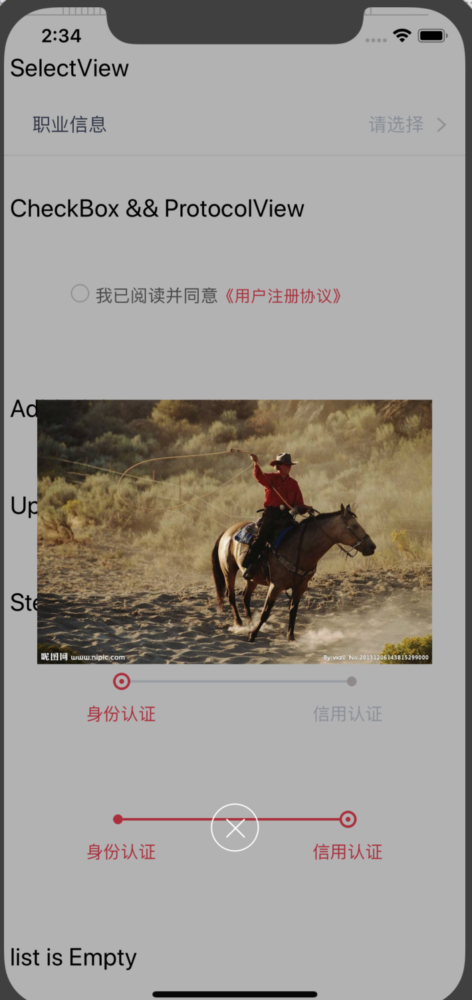
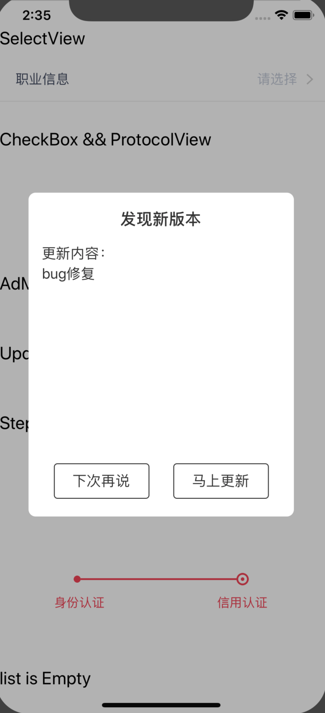
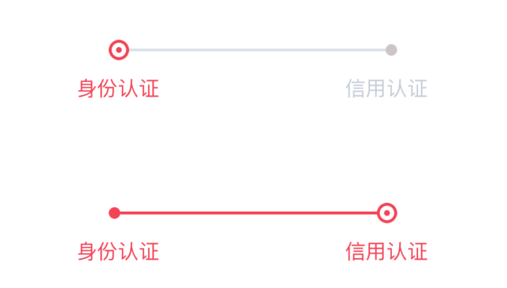

# RNComponents
项目中封装的一些RN组件，部分组件与业务关联紧密，不是很通用，部分组件在原项目中封装了部分业务逻辑，demo中已移除。

# 索引

* [Ruler](#Ruler)
* [SelectView](#SelectView)
* [CheckBox和ProtocolView](#CheckBox和ProtocolView)
* [AdModal](#AdModal)
* [UpdateModal](#UpdateModal)
* [Step](#Step)
* [Empty](#Empty)


## Ruler

* 展示效果

  

* 使用示例

  ```react native
  <Ruler  max={50000}
          min={0}
          step={5}
          width={width*0.92}
          onSelected={(result)=> 
            this.setState({rulerResult:result})
          }
  />
  ```

* 属性
  * max：最大值
  * min：最小值
  * step：间格数，默认内包含10个小间隔
  * width：组件宽度
  * onSelected：选择后回调


## SelectView

* 展示效果

  

* 使用示例

  ```react native
  const occupationData = [
    '上班族',
    '学生',
    '自由职业',
    '无业'
  ]

  <SelectView title={'职业信息'}
              bottomBorderStyle={{marginLeft:0}}
              value={this.state.occupationInfo}
              pickerList={occupationData}
              pickerConfirmCallBack={ (data) => {
                this.setState({occupationInfo: data[0]})
              }}
  />
  ```

* 属性
  * title：左边的标题
  * icon：标题左边icon
  * iconStyle：标题左边icon样式
  * titleStyle：标题样式
  * value：右边的值
  * valueStyle：值样式
  * placeholder：value为空时显示的值，默认是'请选择'
  * hideBottomBorder：是否隐藏底部边框
  * bottomBorderStyle：底部边框样式
  * pickerList：弹出的picker可选列表
  * pickerConfirmCallBack：picker选中后的回调
  * onError：pickerList为空时提示


## CheckBox和ProtocolView

* 展示效果

  

  

* 使用示例

  ```react native
  const protocols = [
    {
      name:'用户注册协议',                      //协议名称
      contentType:'htmlUrl',                  //内容格式（pdfText,htmlText,htmlUrl）
      contentKey:'http://www.baidu.com',      //内容key（pdfText,htmlText是协议的type，htmlUrl是url地址）
    },
  ]

  <View  style={styles.protocolBack}>
    <CheckBox
        isChecked={this.state.checkBoxChecked}
        onChange={(checked) => 
          this.setState({checkBoxChecked:checked})
        }
    />
    <ProtocolView
        frontText={'我已阅读并同意'}
        protocols={protocols}
    />
  </View>
  ```

* CheckBox属性

  * isChecked：选中与否
  * onChange：点击勾选/取消勾选回调

* ProtocolView属性
  * frontText：协议前显示的文本
  * frontStyle：协议前显示的文本的样式
  * protocolStyle：协议样式
  * protocols：协议数组，包括协议名称，协议内容格式（pdfText/htmlText/htmlUrl），内容key（pdfText、htmlText是协议的type，htmlUrl是url地址），查询参数


## AdModal

* 展示效果

  

* 使用示例

  ```react native
  const adInfo = {
    picUrl:'https://timgsa.baidu.com/timg?image&quality=80&size=b9999_10000&sec=1567404793672&di=f8078a4a18bbf92b62d428959da8a7fc&imgtype=0&src=http%3A%2F%2Fpic36.nipic.com%2F20131206%2F12483715_143815299000_2.jpg'
  }
  
  <AdModal
          show={this.state.adModalVisible}
          adInfo={adInfo}
          touchCallBack={() => {
            this.setState({adModalVisible: false})
            //do something other
            console.log('ad touched')
          }}
          closeCallBack={() =>{
            this.setState({adModalVisible: false})
            //do something other
            console.log('ad touched')
          }}
  />
  ```

* 属性

  * show：控制显示与否，显示状态由父组件维护
  * adInfo：弹窗数据对象，包括图片，点击后跳转的url
  * touchCallBack：点图片后回调，回调中更新显示状态
  * closeCallBack：关闭回调，回调中更新显示状态


## UpdateModal

* 展示效果

  

* 使用示例

  ```react native
  const updateInfo = {
    updateType:2,
    downloadUrl:'http://www.baidu.com',
    remark:'bug修复',
  }
  
  //模拟更新检查
  <View style={[styles.content,{alignItems:'center'}]}>
        <TouchableOpacity onPress={()=>{
                if(!this.alterShowed){
                  this.refs.updateModal.show()
                  this.alterShowed = true;
                }
              }}>
           <Text style={{color:'blue'}}>显示更新弹框</Text>
       </TouchableOpacity>
  </View>
  
  <UpdateModal
          ref={'updateModal'}
          updateInfo={updateInfo}
          closeCallBack={() => {
            this.alterShowed = false
            console.log('close updateModal')
          }}
  />
  ```

* 属性

  * updateInfo：更新信息对象，包含更新类型，更新内容，更新下载地址
  * closeCallBack：弹框关闭后回调


## Step

* 展示效果

  

* 使用示例

  ```react native
   <Steps curStep={0}/>
  ```

* 属性

  * curStep：当前进件到那一步，以0为起点，只支持两步（0或1）


## Empty

* 展示效果

  

* 使用示例

  ```react native
  <FlatList
            data={this.state.banks}
            renderItem={this._renderItem}
            ListEmptyComponent={()=> <Empty word={'暂无数据'}/>}
            keyExtractor={(item)=>item.bank_name}
  />
  ```

* 属性

  * word：无数据时显示的文案
  * noMessageIcon:无数据时显示的图标，传入图片（如：require('./res/images/no_message.png')）
